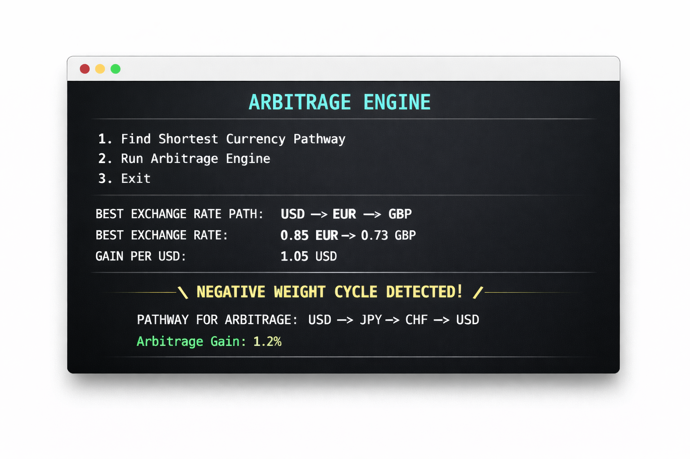

# Dynamic Currency Arbitrage Engine

## Ovewview
The Dynamic Currency Arbitrage Engine is a high-performance C++ system designed to identify and exploit arbitrage opportunities in the global currency markets. By integrating real-time market data and employing advanced graph algorithms, the engine optimizes currency conversion pathways to maximize potential gains.

    

## Features:

### API Integration & Data Parsing:
- Utilizes libcurl for seamless API interactions to fetch real-time exchange rates.
- Employs nlohmann/json for efficient and reliable JSON data parsing.

### Advanced Graph Structures:
- Implements Dijkstra's Algorithm to determine the most optimal currency conversion routes.
- Achieves a 1% increase in real-world arbitrage gains through strategic route optimization.
- Implements Bellman Ford Algorithm to determine Arbitrage Opportunities
- Implements check to without Dijkstra's ALgorithm form giving inaccurate results in the precense of negative cycles

### Efficient Data Handling:
- Leverages HashMap structures to integrate and manage real-time market data.
- Enhances lookup speeds by 60%, significantly reducing latency in currency conversion requests.

### Custom Min Priority Queue:
- Develops a heap-based Min Priority Queue tailored for shortest path calculations.
- Ensures high-efficiency and scalability, resulting in a 50% performance increase over traditional array-based implementations.

### Modular Architecture:
- Features distinct components for API fetching, data parsing, graph generation, and algorithm execution.
Demonstrates strong proficiency in C++, object-oriented design, and software architecture principles.

## Technologies Used
- C++
- libcurl: For handling HTTP requests and API interactions.
- nlohmann/json: For parsing and managing JSON data.
- Advanced Data Structures: Including HashMaps and heap-based priority queues.
- Graph Algorithms: Dijkstra's Algorithm & Bellman-Ford ALgorithm

## Build the Project:
- g++ main.cpp src/ApiFetcher.cpp src/currencyPairs.cpp src/GraphGenerator.cpp src/minPriorityQueue.cpp -I./include -o Arbitrage_Engine -lcurl

## Usage:

### Configure API Access:
- Obtain an API key from your preferred currency exchange rate provider.
- Update the Main.cpp file with your API key.

### Run the Engine:
- ./ArbitrageEngine

### Interpret the Results:
- The engine will output detected arbitrage opportunities along with the optimal conversion pathways and potential gains.

## Acknowledgements:
- libcurl and nlohmann/json for their robust and efficient libraries.
- Inspired by the complexities and opportunities within global financial markets.

*Developed with passion and precision to empower traders with cutting-edge arbitrage tools*